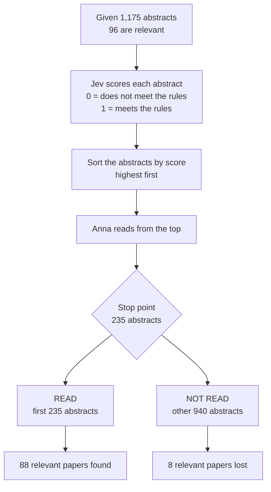

# Jev Abstract Screener

This project tests how well the Jev model ranks paper abstracts for a systematic review.

## Scenario

Anna writes a systematic review about knee cartilage repair. Her search finds 1,175 abstracts. She must find every study that meets her rules.

Anna cannot tell which abstracts are relevant until she reads them. Most are not relevant. In this example, 96 of the 1,175 are relevant.

Reading all 1,175 abstracts takes a long time. If one abstract takes 30 seconds, the work takes about 10 hours.

Anna uses Jev to save time:

1. She gives Jev her rules in `inclusion_criteria.md` and one abstract. 
2. Jev returns a score from 0 to 1. A high score means the abstract probably meets the rules.
3. She repeats this for all 1,175 abstracts.
4. She sorts the abstracts by score, highest first.
5. She reads the list from the top.

Anna stops after she reads a set number of abstracts. We call this number the stop point (see `evaluate_ranking.SHARES`).

For example, she sets the stop point at 235 abstracts. She reads the first 235 abstracts in the list. She never reads the other 940. Jev gave those 940 abstracts lower scores than the first 235. If a relevant paper is in those 940, her review loses it.

The flowchart shows the steps. The numbers are Jev's real result for a stop point of 235 abstracts.



The next picture shows the ranked list. The stop point cuts the list in two parts.

```
Highest Jev score                                          Lowest Jev score
|------------ READ: 235 ------------|---------- NOT READ: 940 ------------|
|  88 relevant papers found         |  8 relevant papers lost             |
                                    ^
                                    stop point
```

Anna needs to know where she can stop. This project answers that question.

## Objective

Find out how far down the ranked list you must read to find almost all relevant papers.

**Target:** find 95% of the relevant papers (92 of 96) and read less than one third of the list (fewer than 392 abstracts).

We compare Jev with two references:
- **BM25:** a free keyword-matching formula.
- **Random order:** you read the abstracts in no special order.

**Outcome:** a table that shows how many relevant papers you find at each reading point. See Results.

## Data

- **Review:** Jeyaraman_2020, from the classic SYNERGY dataset (version 1.0).
- **Size:** 1,175 abstracts. Of these, 96 are relevant.
- **Relevant paper:** The authors of the review chose 96 papers for their final review. We call these papers relevant. They are the answer key.
- **Missing abstracts:** 2 abstracts are empty. Neither is relevant.
- **Source:** `prepare_data.py` downloads the data and writes `data/jeyaraman.csv`.

SYNERGY does not allow you to republish abstracts as plain text. For this reason, `data/` is not in git.

## Method

1. Write the inclusion rules in `inclusion_criteria.md`.
2. Send each abstract and the rules to Jev (`jev-1.13.0`). Jev returns one number from 0 to 1. A high number means the paper meets the rules.
3. Sort the papers by score, highest first.
4. Count how many relevant papers you find as you read down the list.

Jev is not trained in this project. We send it text and read its answer. Nothing is saved or loaded.

The project also scores every abstract with BM25. BM25 is a free keyword-matching formula. It shows what a simple method achieves, so we can see if Jev adds value.

## Results

All numbers use the full set of 1,175 abstracts. The criteria were not tuned after the first run.

**Recall after you read the top part of the ranked list** (recall is the share of relevant papers found):

| Part of list read | Jev | BM25 | Random order |
|---|---|---|---|
| 5% | 52% | 12% | 5% |
| 10% | 84% | 21% | 10% |
| 20% | 92% | 41% | 20% |
| 30% | 92% | 70% | 30% |
| 50% | 93% | 84% | 50% |

**How much of the list you read to find 95% of the relevant papers:**

| Method | Papers read | Share of list | WSS@95 |
|---|---|---|---|
| Jev | 729 of 1,175 | 62% | 0.33 |
| BM25 | 908 of 1,175 | 77% | 0.18 |
| Random order | about 1,116 | about 95% | 0 |

WSS@95 is the work saved over random order at 95% recall. A higher number is better.

### What the results mean

- Jev ranks much better than BM25 and random order.
- After you read the top 10% of the list, you have found 84% of the relevant papers.
- After you read the top 20%, you have found 92%.
- Recall then stays at about 92% to 93%. Jev gave a score of 0.02 or lower to 8 relevant papers. You must read almost to the bottom of the list to find them.
- For this reason, Jev misses your target. It needs 62% of the list to reach 95% recall. Your target was less than 33%.
- One of the 8 papers is about brain injury. The original review included it, but it is not about knee cartilage. This is a label error. We did not read the abstracts of the other 7 to find out why Jev scored them low.

## Limits

- **One review only.** The results can change on a different review. Treat small differences as ties.
- **The labels do not match the paper.** The paper title says "stem cell source in knee osteoarthritis". The included papers are mostly knee cartilage repair studies. We wrote the rules to match the included papers.
- **The rules used knowledge of the data.** We read abstracts and counted words before we wrote `inclusion_criteria.md`. The result is not a clean held-out test.
- **The labels come from full-text screening.** Some papers look relevant in the abstract, but the reviewers excluded them later. Jev scores such papers high. This lowers the precision but not the recall.
- **The stop point is unknown in real use.** Here we know which papers are relevant, so we know when we reach 95%. In a real review, you need a rule that tells you when to stop reading.
- **Abstracts only.** Jev does not see the full text.

## How to run

You need Python 3.12 and [uv](https://docs.astral.sh/uv/).

1. Install the packages:
   ```
   uv sync
   ```
2. Create a `.env` file with your TypeSafe API key (https://console.typesafe.ai/keys)
   ```
   TYPESAFE_API_KEY=your_key_here
   ```
3. Download and export the data:
   ```
   uv run python prepare_data.py
   ```
4. Score the abstracts. The BM25 run is free and takes a few seconds:
   ```
   uv run python score_abstracts.py --scorer bm25 --tag bm25
   uv run python score_abstracts.py --scorer jev --tag v1
   ```
   The Jev run takes about 8 minutes and uses about 1.2 million input tokens. Check the TypeSafe price before you start.
5. Compare the runs:
   ```
   uv run python evaluate_ranking.py v1 bm25
   ```

To test Jev on 20 papers first, add `--limit 20`. The sample has 10 relevant and 10 not relevant papers. `evaluate_ranking.py` refuses a partial run.

A run saves each row when Jev answers. If a run stops, start the same command again. It skips the papers it already scored.

To score again with new rules, change `inclusion_criteria.md` and use a new `--tag`.

## Files

| File | Purpose |
|---|---|
| `prepare_data.py` | Downloads the review and writes `data/jeyaraman.csv` |
| `inclusion_criteria.md` | The inclusion rules that Jev reads with each abstract |
| `score_abstracts.py` | Scores each abstract with Jev or BM25 |
| `evaluate_ranking.py` | Prints the recall tables and the lowest-scored relevant papers |
| `utils.py` | Shared paths and loaders |
| `explore_synergy_dataset.ipynb` | Notebook to look at the data |
| `results/` | One score file for each run |

